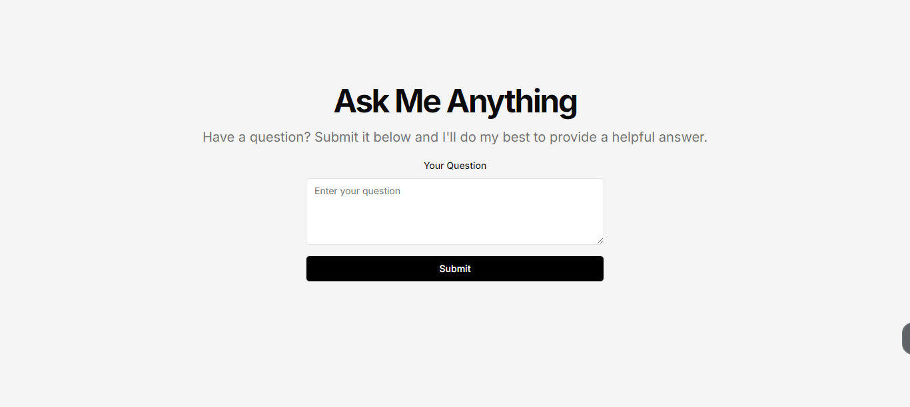

# Ask Me Anything

A simple Q&A website built with Next.js and MongoDB.

## Overview

This website allows users to submit questions and receive helpful answers. It features a clean, minimalist design with a straightforward interface.

## Live Demo

Check out the live version of the website: [Ask Me Anything](https://ama-beige.vercel.app/)

## Features

- User-friendly question submission form
- Backend powered by Next.js for server-side rendering and API routes
- MongoDB database for storing and retrieving questions and answers

## Tech Stack

- Frontend: Next.js (React framework)
- Backend: Next.js API routes
- Database: MongoDB
- Full-stack: Next.js
